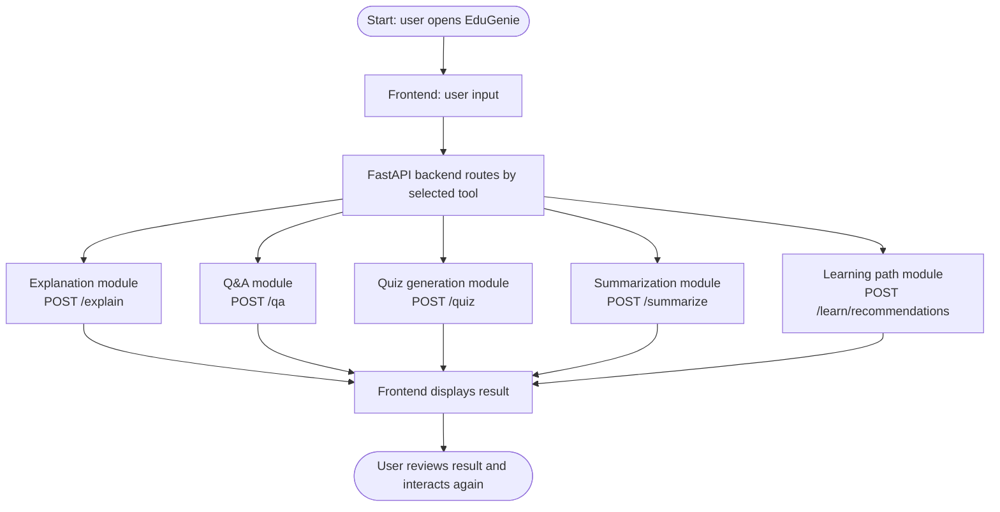

# Project Overview

EduGenie is a modular AI educational assistant built for self-learners. The browser UI sends JSON requests to FastAPI; each route delegates to a focused module; the module builds a learner-oriented prompt; and the shared AI service calls Gemini or returns an offline demo response.

```text
Browser -> FastAPI -> feature module -> AIService -> Gemini API
                         |                   |
                         +-- quiz JSON      +-- demo fallback
```

## Application Flow



The architecture is intentionally small for learning and easy extension. Future work can add authentication, saved study history, PDF/image input, progress tracking, multilingual output, and teacher dashboards.
